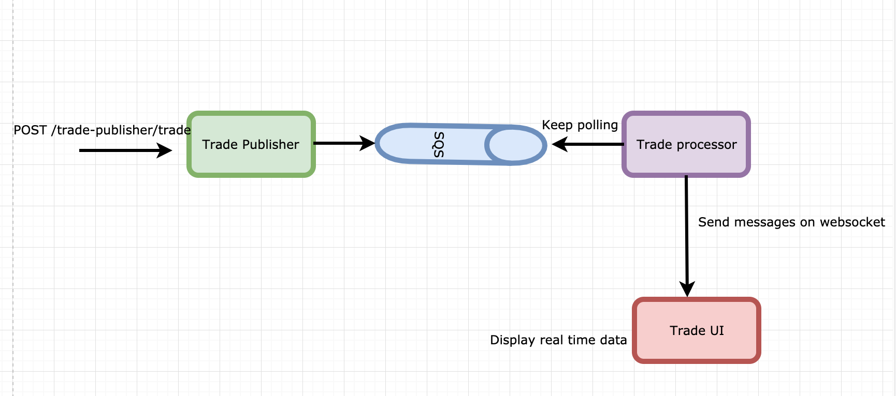

# Trade Application

## Architecture:
 
 * **TradePublisher** : publishes messages on SQS. Local dockerized developemnt environmet has [elasticMq](https://github.com/softwaremill/elasticmq) which has SQS compatible rest interface. 
 **Tech** : JAVA Spring boot, spring cloud
 
 
 * **TradeProcess** : subscribed to the queue and calculate ```total transactions```, ```minExchangeRate``` and ```maxExhcangeRate``` per country. It publishes the calculated data  on **websocket**.
 **Tech** : JAVA Spring boot, spring cloud, Websocket
 
  * **TradeUI** : creates websocket connection with tradeProcessor. When message arrives it displays messages on UI at realtime and add marker on country with total transactions Google Map.
  **Tech** : angular, sockjs,google maps, bootstrap 
  
   
  * **docker-compose**: All the services are containerized.
   
## How to run application:
**Note**: Make sure you have docker installed on your machine. [Install docker](https://docs.docker.com/compose/install/)

```
$ git clone git@github.com:juhijariwala/trade-app.git
```
**Project Structure**

```
.
├── trade-app
│   ├── trade-processor
│   │   └── src
|   |   └── Dockerfile 
│   ├── trade-publisher
│   │   └── src
|   |   └── Dockerfile
│   ├── trade-ui
│   │   └── src
|   |   └── Dockerfile
└── docker-compose.yml
└── .env
```
* Add your google [API KEY](https://developers.google.com/maps/documentation/javascript/get-api-key) to access maps in .env file.
```
$ vi .env
$ replace '<PLACE_API_KEY>' with google API Key
$ docker-compose build
$ docker-compose up  
$ docker ps
CONTAINER ID        IMAGE               COMMAND                  CREATED             STATUS              PORTS                    NAMES
d702c1d68386        trade-ui            "nginx -g 'daemon of…"   About an hour ago   Up About an hour    0.0.0.0:4201->80/tcp     trade-app_trade-ui_1
e0e8d3654cc2        trade-processor     "/bin/sh -c 'java -j…"   About an hour ago   Up About an hour    0.0.0.0:8090->8080/tcp   trade-app_trade-processor_1
ab8a92197fef        trade-publisher     "/bin/sh -c 'java -j…"   About an hour ago   Up About an hour    0.0.0.0:8080->8080/tcp   trade-app_trade-publisher_1
6d1830f9e33f        s12v/elasticmq      "java -Djava.net.pre…"   About an hour ago   Up About an hour    0.0.0.0:9324->9324/tcp   trade-app_queue_1
```

* Open your browser and navigate to ```http://localhost:4201```. You should see the Web Page:
  
* POST messgae on trade-publisher
```
curl -d '{"userId": "2364", "currencyFrom": "NOK", "currencyTo": "INR","amountSell": 3444, "amountBuy": 100.10, "rate": 0.451,"timePlaced" : "24-JAN-18 10:27:44", "originatingCountry" : "IN"}'\
 -H "Content-Type:application/json"\
 -X POST http://localhost:8080/trade-publisher/trade

```
Check the UI. You should be able to see the messages updating real time. 
